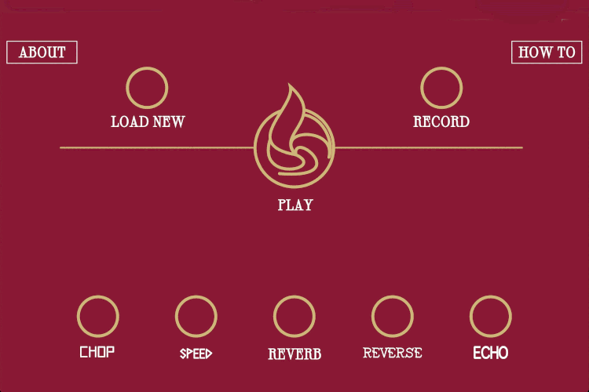

# Reflections

This is an [interactive sound installation](https://www.wigmoreinteractive.com/) by [Gawain Hewitt](https://gawainhewitt.co.uk/).

Created for the [Wigmore Hall Learning](https://wigmore-hall.org.uk/learning/learning-landing-page) Festival, Reflections, this installation invites you to create new musical sounds by manipulating original audio using a series of specially created effects.

Like a droplet on the surface of water changes a reflection, these effects change the sound in endlessly unexpected ways, allowing for hours of musical play!

The featured Wigmore Hall Learning sounds are: an excerpt of Daniel Fardon's 'Six Movements' performed by the Bloomsbury Quartet at Wigmore Hall, as well as recordings from [Chamber Tots](https://wigmore-hall.org.uk/learning/chamber-tots), [Singing With Friends](https://wigmore-hall.org.uk/learning/music-for-life), [Chestnuts Primary School](https://wigmore-hall.org.uk/learning/partner-schools-programme) and [Come and Create](https://wigmore-hall.org.uk/learning/come-and-create). 

## User Instructions

Press 'load new' then 'play' to begin hearing a snippet of sound from the Wigmore Hall Learning programme, or press 'record' to capture your own sound file using your phone or computer's microphone.

Use the effect buttons to change the sound's reflection.

Each time you click an effect it will behave slightly differently, as some of the parameters are chosen randomly. 'Chop' slices the sound up, adding a sense of rhythm. 'Speed' either speeds up or slows down the sound. 'Reverb' gives the effect of being in a large space, such as Wigmore Hall itself. 'Reverse' plays the sound backwards (may not work on all browsers). 'Echo' repeats the sound at a random interval.

Best experienced on Google Chrome.

Remember to switch your side mute button to off if on an iPhone.

## About the design and piece

I was commissioned by Wigmore Hall Learning to make a piece that celebrated the music made on their community programme, and also allowed the audience to create music themselves. The theme of the festival was reflections, and they wanted this to feature in the piece as well.  

### The brief

An online interactive installation on the theme of the Learning Festival, Reflections.
Mirror, mirror on the wall … Join us for our annual Learning Festival as we explore the realm of reflections through a series of creative workshops and concerts for all ages. Together we’ll take a journey through the looking glass to discover musical mirrors, distortions, refractions and re-imaginings.   
We’ll also reflect and celebrate the work of artists and participants from across the Learning programme, sharing their voices, creativity and music; and we invite you to join us in sharing your own musical moments.

Later conversations added the following:

* an aesthetic that suggested reflections in some way, perhaps through mirrored image or ripples in water or both.

* Needs to fit with Wigmore Hall aesthetic and brand

* Include the option to add new content

* Stretch goal - user can record their own content

 

My suggestion was to make a piece that contained recordings of pieces from the learning programme but also allowed audience to record themselves. Additionally this piece could also be a musical instrument itself and used within workshops. 
  
I built the piece using JavaScript. [p5.js](https://p5js.org/) was used for the graphics and [tone.js](https://tonejs.github.io/) for sound. 
   
Aesthetically I worked with the producer to explore ways to make it link to Widmore Hall which I did with the colour and making the main button a version of the flame from the original logo. Creating this flame as a lightweight scaleable image was a challenge, and I wrote a helper application to enable me to trace the image and turn it into a vector which can be found [here](https://github.com/gawainhewitt/graphicsSketcher).
   
The visualisation is coded directly and measures the amplitude, turning this into graphics in real time. One side showing the uneffected audio and the other the effected audio.
  

## Known bugs

Reverse funciton only works on Google Chrome. 

## Reflections on things I would do differently next time

This piece represents my best work at the time of making it. Looking back at it now I would seperate it into different classes to ensure that the code was easier to read, fix and change. I would also consider other libraries as well as p5.js for rendering the graphics. 

Lastly I would consider whether it would be benificial to build in React. 